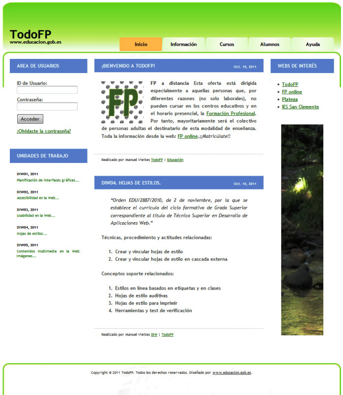

# Título del Proyecto

TAREA 4 DIW

### Requisitos 🔧

1. Ancho cabecera: 920px, con padding superior, izquierda y derecha de 20px.
2. Las opciones del menú están programadas como una lista.
    Cada opción es un hiperenlace cuyo color de fondo cambia al pasar el ratón por encima.
3. Columna izquierda: ancho de 220px.
4. Columna central : 480px, padding left 20px.
5. Columna derecha: 180px, padding left 20px.
6. Pie de página: 960px de ancho.
7. Fijarse en los bordes de las cajas, de la página principal y del pie de página.

## Construido con 🛠️

Visual code

## Autores ✒️

***Juan Lopez

## Ejemplo ✒️

